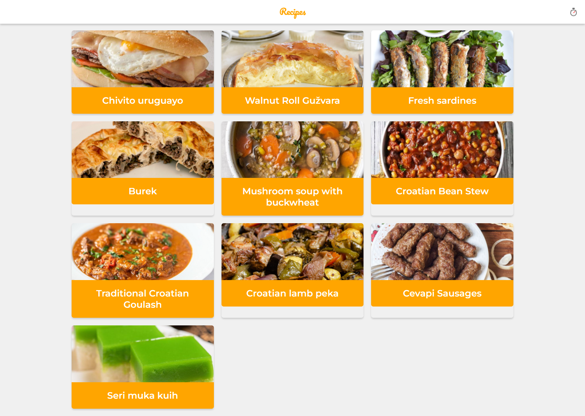

# Recipes App

Deployed in: https://recipes-app-three.vercel.app/

This is a PWA that use MealDB API to show different recipes with instructions.

## Features:

- Offline support with workbox
- Network strategies
- Add to home screen
- Web share API

- Create with [Create React App](https://github.com/facebook/create-react-app).

## Scripts

- `npm install` to install dependencies
- `npm run dev` dev env
- `npm run build && npm start` prod env

## License

MIT

Made during this [course](https://platzi.com/cursos/pwa-react-js/)
